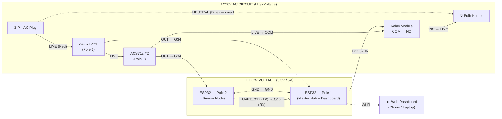
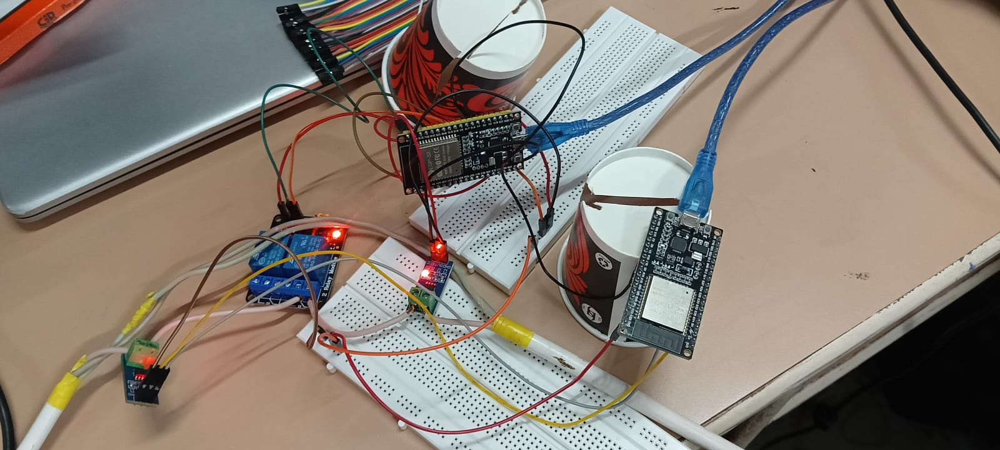

# 🔌 CONNECTIONS — Complete Wiring Guide

This document explains **exactly** how to wire every component of the Line_IQ Smart Grid Fault Detection system from scratch.

---

## 🗺️ Full Circuit Diagram



> **Note:** The ACS712 **OUT / VCC / GND** pins are the small header pins on the sensor board. They are **not** the green screw terminals. The screw terminals carry 220V and connect only to the Live wire.

### 📸 Actual Prototype



---

## 📋 What You Need

| # | Component | Label Used Below |
|---|---|---|
| 1 | ESP32 Wroom 38-pin (Board #1) | **ESP32-Pole1** |
| 2 | ESP32 Wroom 38-pin (Board #2) | **ESP32-Pole2** |
| 3 | ACS712 Current Sensor 5A (Sensor #1) | **ACS-1** |
| 4 | ACS712 Current Sensor 5A (Sensor #2) | **ACS-2** |
| 5 | 5V Relay Module (1-Channel) | **RELAY** |
| 6 | 3-Pin AC Plug | **PLUG** |
| 7 | Incandescent Bulb + Holder | **BULB** |
| 8 | AC Wire (2-core, ~2 meters) | **AC-WIRE** |
| 9 | Jumper Wires (M-M, M-F) | — |
| 10 | 2x Breadboards | — |
| 11 | 2x USB Cables (for power) | — |

---

## 🔴 PART 1: The AC Power Circuit (220V Live Wire)

> ⚠️ **WARNING:** This section deals with 220V mains electricity. **Do NOT touch any bare copper wires while the circuit is powered on.** Always turn off the extension board switch before making any changes.

The AC circuit is a **single series loop** on the **Live (Red) wire**. The Neutral wire goes directly from plug to bulb.

### Circuit Diagram (AC Path)

```
            RED (LIVE)          RED            RED              RED
 ┌───────┐ ─────────► ┌───────┐ ─────► ┌───────┐ ─────► ┌─────────────┐ ─────► ┌────────┐
 │  AC   │            │ ACS-1 │        │ ACS-2 │        │   RELAY     │        │  BULB  │
 │ PLUG  │            │Pole 1 │        │Pole 2 │        │ COM  →  NC  │        │ HOLDER │
 └───┬───┘            └───────┘        └───────┘        └─────────────┘        └───┬────┘
     │                                                                            │
     └────────────────────────── BLUE (NEUTRAL) — DIRECT ─────────────────────────┘
```

### Step-by-Step AC Wiring

**Step 1 — Prepare the AC Plug:**
1. Unscrew the 3-pin plug cover.
2. You will see 3 terminals inside. **Ignore the top large Earth pin.**
3. Strip ~1cm of insulation from both ends of your 2-core AC wire.
4. Connect the **Red wire** to one of the bottom pins. Tighten the screw.
5. Connect the **Blue/Black wire** to the other bottom pin. Tighten the screw.
6. Close the plug cover.

**Step 2 — Wire the Neutral (Blue) — Direct Path:**
1. Take the **Blue wire** from the other end of your AC cable.
2. Screw it directly into **one terminal of the Bulb Holder**.
3. That's it for Neutral — it bypasses everything.

**Step 3 — Wire the Live (Red) — Through Sensors & Relay:**
1. Take the **Red wire** from the other end of your AC cable.
2. Screw it into the **input terminal** of **ACS-1 (Pole 1 Sensor)** green screw block.
3. Take a new piece of red wire from the **output terminal** of **ACS-1**.
4. Screw that into the **input terminal** of **ACS-2 (Pole 2 Sensor)** green screw block.
5. Take a new piece of red wire from the **output terminal** of **ACS-2**.
6. Screw that into the **COM (Common/Middle)** terminal of the **Relay Module**.
7. Take a final piece of red wire from the **NC (Normally Closed)** terminal of the Relay.
8. Screw that into the **second terminal of the Bulb Holder**.

> 💡 **Why NC and not NO?** NC (Normally Closed) means the circuit is complete by default, so the bulb glows as soon as you plug in. When the ESP32 detects a fault, it energizes the relay coil which **opens** the NC contact and cuts power to the bulb.

---

## 🟢 PART 2: Sensor → ESP32 Connections (Low Voltage, 3.3V/5V)

These connections use **jumper wires** on the breadboard. They are completely safe to touch.

### ESP32 Pole 1 (Master Hub) — Pin Connections

```
  ┌────────────────────────────────┐
  │        ESP32 - Pole 1          │
  │        (Master Hub)            │
  │                                │
  │   G34 ◄──── ACS-1 OUT pin     │  (Analog current reading)
  │   G23 ────► RELAY IN/SIG pin  │  (Digital relay control)
  │   G16 ◄──── ESP32-Pole2 G17   │  (UART RX — receives data)
  │                                │
  │   VIN ────► ACS-1 VCC         │  (5V power to sensor)
  │   GND ────► ACS-1 GND         │  (Ground)
  │   GND ────► RELAY GND         │  (Ground)
  │   VIN ────► RELAY VCC         │  (5V power to relay)
  │   GND ────► ESP32-Pole2 GND   │  (Common ground between boards)
  └────────────────────────────────┘
```

| ESP32-Pole1 Pin | Connects To | Wire Color (Suggested) |
|---|---|---|
| **G34** | ACS-1 → OUT | Yellow |
| **G23** | Relay → IN (Signal) | Orange |
| **G16** | ESP32-Pole2 → G17 | Green |
| **VIN** | ACS-1 → VCC | Red |
| **VIN** | Relay → VCC | Red |
| **GND** | ACS-1 → GND | Black |
| **GND** | Relay → GND | Black |
| **GND** | ESP32-Pole2 → GND | Black |

### ESP32 Pole 2 (Sensor Node) — Pin Connections

```
  ┌────────────────────────────────┐
  │        ESP32 - Pole 2          │
  │       (Sensor Node)            │
  │                                │
  │   G34 ◄──── ACS-2 OUT pin     │  (Analog current reading)
  │   G17 ────► ESP32-Pole1 G16   │  (UART TX — sends data)
  │                                │
  │   VIN ────► ACS-2 VCC         │  (5V power to sensor)
  │   GND ────► ACS-2 GND         │  (Ground)
  │   GND ────► ESP32-Pole1 GND   │  (Common ground between boards)
  └────────────────────────────────┘
```

| ESP32-Pole2 Pin | Connects To | Wire Color (Suggested) |
|---|---|---|
| **G34** | ACS-2 → OUT | Yellow |
| **G17** | ESP32-Pole1 → G16 | Green |
| **VIN** | ACS-2 → VCC | Red |
| **GND** | ACS-2 → GND | Black |
| **GND** | ESP32-Pole1 → GND | Black |

---

## 🟡 PART 3: UART Data Link (Between the Two ESP32s)

This is the **most critical wire** in the entire project. It is the "communication line" between the two poles.

```
  ESP32-Pole2                          ESP32-Pole1
  ┌──────────┐     GREEN WIRE          ┌──────────┐
  │     G17  ├─────────────────────────┤  G16     │   UART Data (TX → RX)
  │          │                         │          │
  │     GND  ├─────────────────────────┤  GND     │   Common Ground
  └──────────┘     BLACK WIRE          └──────────┘
```

**Only 2 wires are needed:**
1. **Green Wire:** Pole 2 G17 (TX) → Pole 1 G16 (RX) — This carries the current sensor data.
2. **Black Wire:** Pole 2 GND → Pole 1 GND — Both boards must share a common ground.

> 🎯 **Demo Tip:** During the live demo, pulling out the **Green UART wire (G17)** simulates a communication fault. The dashboard will detect the loss within 4 seconds and automatically trip the relay to cut power to the bulb.

---

## 🔵 PART 4: ACS712 Sensor Module Pinout

Each ACS712 module has **5 connections:**

```
  ┌─────────────────────────────┐
  │         ACS712 5A           │
  │                             │
  │  [SCREW 1]     [SCREW 2]   │  ← 220V AC wire passes through here
  │   (AC IN)       (AC OUT)   │    (just the LIVE wire, in series)
  │                             │
  │   VCC    OUT    GND         │  ← Low-voltage pins (connect to ESP32)
  │    │      │      │          │
  └────┼──────┼──────┼──────────┘
       │      │      │
      5V    G34    GND
     (ESP)  (ESP)  (ESP)
```

- **Screw terminals (top):** The 220V Live wire passes **through** these two terminals. Current flows in one screw and out the other.
- **VCC:** Connect to ESP32 VIN (5V).
- **OUT:** Connect to ESP32 G34 (Analog input). This outputs a voltage proportional to the current flowing through the screw terminals.
- **GND:** Connect to ESP32 GND.

---

## 🔴 PART 5: Relay Module Pinout

The relay module has **two sides:**

```
  ┌─────────────────────────────────────┐
  │           5V RELAY MODULE           │
  │                                     │
  │  HIGH-VOLTAGE SIDE (220V AC):       │
  │  ┌───┐  ┌───┐  ┌───┐               │
  │  │ NC│  │COM│  │ NO│               │
  │  └─┬─┘  └─┬─┘  └─┬─┘               │
  │    │      │      │                  │
  │    │    AC IN   (unused)            │
  │    │   from                         │
  │    │   ACS-2                        │
  │    │                                │
  │   AC OUT                            │
  │   to BULB                           │
  │                                     │
  │  LOW-VOLTAGE SIDE (ESP32 Control):  │
  │   VCC    IN/SIG   GND              │
  │    │       │        │               │
  │   5V     G23      GND              │
  │  (ESP)   (ESP)    (ESP)             │
  └─────────────────────────────────────┘
```

| Relay Pin | Connected To |
|---|---|
| **COM** (Common) | Red wire coming FROM ACS-2 output |
| **NC** (Normally Closed) | Red wire going TO the Bulb Holder |
| **NO** (Normally Open) | Nothing (leave empty) |
| **VCC** | ESP32-Pole1 VIN (5V) |
| **IN / SIG** | ESP32-Pole1 G23 |
| **GND** | ESP32-Pole1 GND |

---

## ⚡ PART 6: Power Supply

| Board | Power Source | Notes |
|---|---|---|
| ESP32-Pole1 | USB cable → Phone Charger or Power Bank | **Do NOT use laptop USB while 220V is connected!** |
| ESP32-Pole2 | USB cable → Phone Charger or Power Bank | Same warning applies |

> 🛑 **SAFETY:** When the 220V AC circuit is live, both ESP32 boards must be powered by chargers or power banks — **never** through USB connected to your laptop. The ACS712 provides galvanic isolation, but a loose wire on a breadboard could bridge 220V to the USB line and destroy your laptop.

---

## ✅ Final Checklist Before Powering On

- [ ] Red (Live) wire goes: Plug → ACS-1 → ACS-2 → Relay COM → Relay NC → Bulb
- [ ] Blue (Neutral) wire goes: Plug → Bulb (direct)
- [ ] ACS-1 OUT → ESP32-Pole1 G34
- [ ] ACS-2 OUT → ESP32-Pole2 G34
- [ ] Relay IN/SIG → ESP32-Pole1 G23
- [ ] UART: Pole2 G17 → Pole1 G16
- [ ] GND wire connecting both ESP32 boards
- [ ] Both ESP32s powered by chargers (NOT laptop USB)
- [ ] No exposed bare copper wires touching each other
- [ ] Extension board switch is OFF before plugging in the AC plug
- [ ] Bulb is screwed into the holder

---

## 🎯 Quick Reference — All Connections at a Glance

```
┌─────────────────────────────────────────────────────────────────────────┐
│                        COMPLETE SYSTEM WIRING                          │
│                                                                        │
│   AC PLUG ──RED──► ACS-1 ──RED──► ACS-2 ──RED──► RELAY(COM→NC) ──► BULB  │
│      │                                                              │  │
│      └──────────────── BLUE (Neutral, Direct) ──────────────────────┘  │
│                                                                        │
│   ESP32-Pole1:  G34←ACS1   G23→RELAY   G16←(UART from Pole2)         │
│   ESP32-Pole2:  G34←ACS2   G17→(UART to Pole1)                       │
│   Common GND wire between both ESP32 boards                           │
│                                                                        │
│   Power: Both ESP32s via USB charger / power bank                     │
│   Dashboard: http://<ESP32-Pole1-IP> on any device via Wi-Fi          │
└─────────────────────────────────────────────────────────────────────────┘
```
